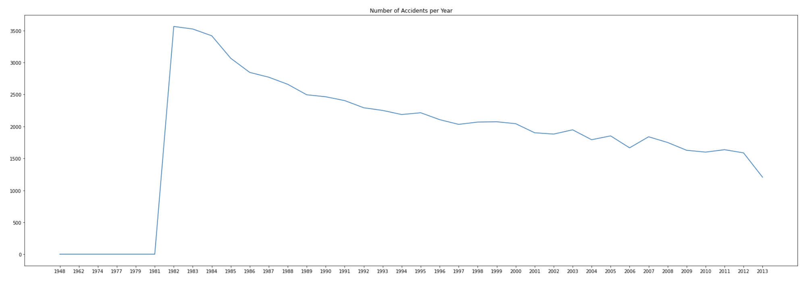
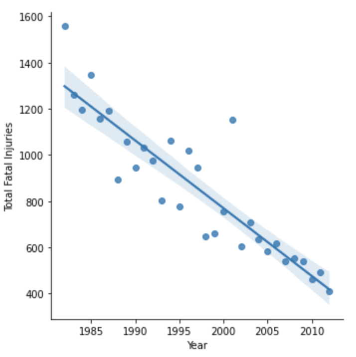
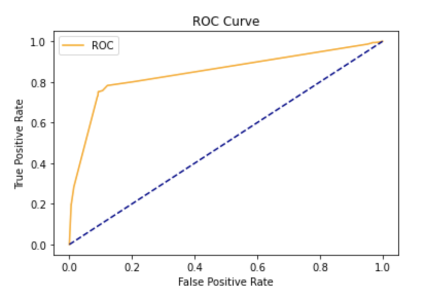
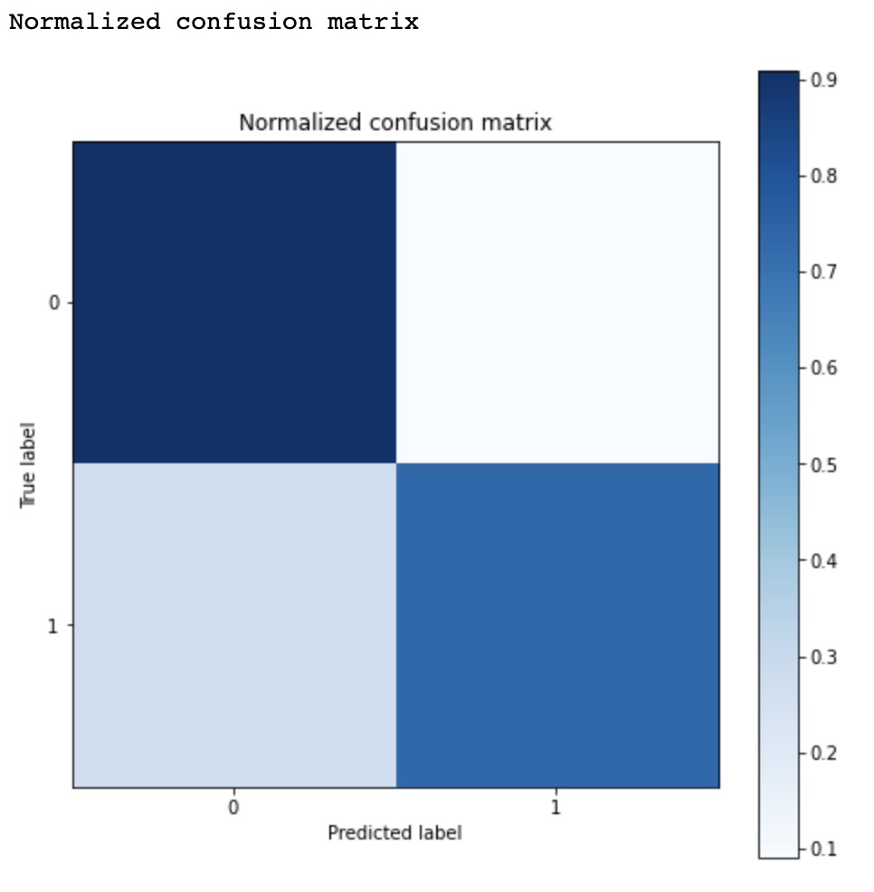

# Abstract

# Introduction

You hear the pilot yelling “Mayday Mayday!” over the intercom. What do you do? Brace? Hug your loved ones? Turn off airplane mode and text your family? We hope you never have to experience anything remotely close to this but the recent 20 year memorial of 9/11 got us thinking about what causes a plane to crash. Though we cannot completely eradicate the mishaps of airplanes, we will study the causes of fatalities and use various data mining techniques to determine the risk associated with flying.

Our dataset comes from the National Transportation and Safety Board and consists of over 74 thousand accidents and incidents from 1948 to 2013 (https://data.ntsb.gov/avdata). The problem that we set out was to determine whether aviation is becoming safer as time moves forward. This is quantified by analyzing the number of fatal accidents with respect to relevant crash data as well as quantifying the total number of accidents that have occured overtime. Not only that but we set out to determine if a crash can be predicted given various factors/features. If a crash can be predicted then we will be able to evaluate the likelihood that a crash will occur and would eventually be able to step in and stop the flight. In our analysis, we have considered specific parameters that are crucial for predicting (or can lead up to) a crash, such as no. of engines, weather, etc. With these pointers the manufacturers and air crew members can take extra caution before taking off.

This was performed with techniques such as dimensionality reduction to cluster whether certain types of crashes are fatal, linear regression to predict the total number of fatalities, logistic regression to determine the strongest flight predictors to lead to a fatal crash, random forest to binary classify if a crash would be fatal or not. More in-depth details of these processes are seen in the Methods section.

# Methods

The main focus of our project/paper boils down to 3 questions/ideas: 1. are airplanes are becoming safer over time, 2. predicting if a crash will be fatal or not,  and 3. Being able to predict the number of fatalities on a said flight. 

To answer the first question, we first set out to analyze the trends with the number of accidents and the number of fatalities that are occurring over time. Determining if flights are becoming safer over time is something that can be seen by plotting the total number of accidents that occur over the years. This is seen below:
(Figure 2)

As we can see there appears to be a downwards trend to this data. To further prove that the data is on this trend we can fit a line (linear model) to the data and get the slope of that line. We omitted the years before 1982 since they are reported at 0. This is seen below:
(Figure 3)

Based on the slope of the line above we can see that it is clearly negative. Therefore we strongly believe that based on this data the number of accidents is decreasing as time goes on. 

Similarly, we can look at the total number of fatalities that are occuring overtime. This is seen below:
(Figure 4)

Again we are seeing a decrease in the total number of fatalities that are occuring over the years. To further prove this we fit a line on this data. This is shown below: 
(Figure 5)

Once again we are seeing a decrease in the number of fatalities and a negative slope of this line. Therefore we can strongly conclude that the number of fatalities over time is decreasing. Overall, we can use these two analysis types to firmly argue that the flights are becoming safer overtime. 

We next set out to answer the question of predicting the total number of fatalities on a given flight. Using the method of Linear Regression, we are trying to predict the total number of fatalities that had occured. The parameters considered for the linear regression are Aircraft Damage,Make, Model, Amateur Built,Engine Type, Air Carrier, Weather Condition, Broad Phase of Flight, and Location_State. The data is split into train and test data and the model is fit to predict the predictor. The test data is tested for prediction quality and found out that the model predicted most of the total fatality values correctly.  The Root mean square error is calculated to check the accuracy of the model and the RMSE observed is 3.4 and Mean Absolute Error (MAE) is found to be -0.428  with very few outliers. This is because most of the fatalities lie within a very small range from 0-10 and distributed mostly around 0-4. 

To answer our third question (predicting whether a crash will be fatal or not) we used multiple approaches since it is a classification problem. First we used Logistic Regression, then Random Forests, and lastly Clustering after Dimensionality Reduction from Principal Component Analysis.

 To perform Logistic Regression, is_fatal was used as an indicator variable to represent if the accident contained fatal injuries. Crash data was assessed solely from the United States as preliminary analysis showed little to no crash data contained from other countries. The label variable was coded as follows 1=fatal, 0= not fatal. For this analysis, the predictor variables used were ‘Aircraft damage’, ‘Number of Engines’, and ‘Weather Condition’. These variables were chosen as they showed reasonable variance within the model and contained fewer missing values than other variables. The missing values that were contained within these features were encoded with the most frequent values for each category. With standard hyperparameters, the model had a prediction accuracy of 87% and an AUC value of 83%. After hyperparameter tuning with gridsearch, the score marginally improved to 88% and 84% respectively.

<!--  -->

The ROC curve above shows the optimized parameter model does a reasonable job at distinguishing between when a plane crash is fatal and nonfatal. This is confirmed with the AUC value of 0.84.

The normalized confusion matrix reflects this as well with most of the predictions being either true positives or true negatives. 

Continuing off this analysis we took another approach to answer the question, Random Forests. To binary classify whether a certain class would be fatal or not, we used a Random Forest (RF) Model. The RF model consisted of features/variables such as: Number of Engines, Month of the Crash, Type of Aircraft, Air Carrier, etc. The RF was run with a Grid Search that allowed for hyperparameter tuning. The Grid Search optimizes the hyperparameters and will return the model which results in the most accurate predictions. In this case, the Grid Search found that: the best criterion to measure the quality of the split with the Gini index, max depth of the tree to be 20, Max leaf nodes was set to None, and min sample leafs was set to be 5. With these parameters selected the RF returned a testing accuracy of 89.23% and a training accuracy of 92.76%. To compare these results we also ran a RF with default parameters and got a testing accuracy of 88.95% and training accuracy of 99.99%. This shows that the RF with Grid Search is a better model because it doesn’t overfit to the training data like the default RF but the Grid Search RF also has a higher testing accuracy. The choice to use a random forest model is a stronger decision than using a Decision Tree because the Random Forest model is composed of a collection of Decision Trees and is able to make decisions based on multiple decision trees rather than just 1 DT. Along with that reasoning, hyperparameter tuning was able to make the model even better. Below is a table of our results from the Random Forest with Hyper Parameter tuning:

<!-- |    Stats   | Random Forest w/ Grid Search Results |
| --------------------- | -------------------------- |
| Accuracy      | 89.2312% |
| Precision   | 92.164% |
| Recall   | 94.822% |
| Specificity   | 64.8484% |
| False Negative Rate   | 5.177% |
| False Positive Rate   | 35.15% | -->

(Figure 17)

Lastly, we tried using Principal Component Analysis to reduce the dimensionality reduction.  PCA basically aims to reduce the number of variables of a data set, while preserving as much information as possible. Our dataset had 31 distinct features (columns) to begin with, which got reduced to 22 columns after preprocessing, out of which around 75% had discrete values in them. To prepare the data for pca, we used standard scalar for continuous data and one hot encoding for categorical variables. To understand the relationship between data, we plotted a covariance matrix. As expected, the data was highly unrelated. It could be inferred that the inertia given to a categorical variable inherently depends on the number of modalities available to the variable, and on the probabilities of those modalities. As a result, it would be impossible to give a similar weight to all the initial variables over the calculated components. We tried alternate approaches like Multiple Correspondence Analysis- a variation of PCA to analyze categorical data and Factorial Analysis of Mixed Data, which generalized the PCA algorithm to incorporate both numerical and categorical data.

# Comparisons

# Example Analysis

# Conclusions

# References
