# Abstract

This paper assesses the overall safety of aviation. Specifically in relation to plane crashes over time. Food for thought in this analysis includes questions such as whether it is becoming safer to fly over time. When crashes do occur, based on specific airplane and flight conditions, how likely is the crash to be fatal? This analysis utilized machine learning methods such as Linear Regression, Logistic Regression, Decision Trees, Random Forests, PCA and Clustering. The ultimate findings showed that not only is aviation becoming increasingly safer, but when crashes do occur, it is completely feasible to predict whether those crashes will be fatal and if so, the number of fatalities. For future insight, this information may be used to better select and construct airplanes and decide on optimal flight times. 

# Introduction

You hear the pilot yelling “Mayday Mayday!” over the intercom. What do you do? Brace? Hug your loved ones? Turn off airplane mode and text your family? We hope you never have to experience anything remotely close to this but the recent 20 year memorial of 9/11 got us thinking about what causes a plane to crash. Though we cannot completely eradicate the mishaps of airplanes, we will study the causes of fatalities and use various data mining techniques to determine the risk associated with flying.

Our dataset comes from the National Transportation and Safety Board and consists of over 74 thousand accidents and incidents from 1948 to 2013 (https://data.ntsb.gov/avdata, also see `Data Description` below for more info). The problem that we set out to determine was whether aviation is becoming safer as time moves forward. This is quantified by analyzing the number of fatal accidents with respect to relevant crash data as well as quantifying the total number of accidents that have occured overtime. Not only that but we set out to determine if a crash can be predicted given various factors/features. If a crash can be predicted then we will be able to evaluate the likelihood that a crash will occur and would eventually be able to step in and stop the flight. In our analysis, we have considered specific parameters that are crucial for predicting (or can lead up to) a crash, such as number of engines, weather, etc. With these pointers the manufacturers and air crew members can take extra caution before taking off.

This was performed with techniques such as Dimensionality Reduction to cluster whether certain types of crashes are fatal, Linear Regression to predict the total number of fatalities, Logistic Regression to determine the strongest flight predictors to lead to a fatal crash, and Random Forest to binary classify if a crash would be fatal or not. More in-depth details of these processes are seen in the Methods section.

#### Data Description 
\
We are using Aviation Accident Database from NTSB’s official website. The Data consists of 32 columns and 74428 rows. The data broadly consists of 5 categories:
- Accident Information : Event Data, Location, Investigation Type, Injury Severity
- Aircraft Information: Category, Amateur Built, Make, Model, Number of Engines, Engine Type, Damage
- Operation: Operation, Purpose of Flight, Schedule, Air Carrier
- NTSB status: Accident Number, Report Status, Probable Cause Issue Date
- Event Details: Airport Name, Airport Code, Weather Condition, Broad Phase of Flight, Longitude, Latitude

The specifics of each column, a short description, and their meaning can be found using Aviation Data Dictionary [3] (reference number 3 in our `References` section).

# Experiment and Analysis (Methods)

The main focus of our project/paper boils down to three questions and ideas. Are airplanes becoming safer over time? What features are strongest at predicting if a crash will be fatal or not?  Based on the crash attributes, is it possible to predict the number of fatalities on a said flight. 

To begin our analysis we first looked into the number of fatal injuries that happened over years across different countries. According to statistics most number of incidents happened in the United States, hence it made sense to consider crashes across the USA for further analysis (Figure 1).
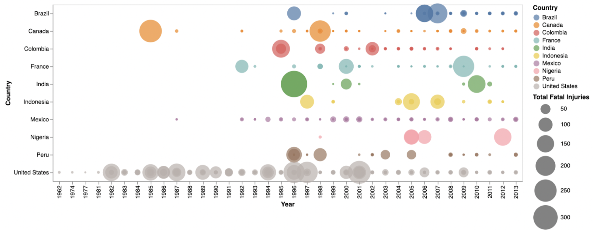 
Figure 1.

To answer the first question, we first set out to analyze the trends with the number of accidents and the number of fatalities that are occurring over time. Determining if flights are becoming safer over time is something that can be seen by plotting the total number of accidents that occur over the years. This is seen below (Figure 2):

Figure 2.
 

As we can see there appears to be a downwards trend to this data. To further prove that the data is on this trend we can fit a line (linear model) to the data and get the slope of that line. This is seen below (Figure 3):
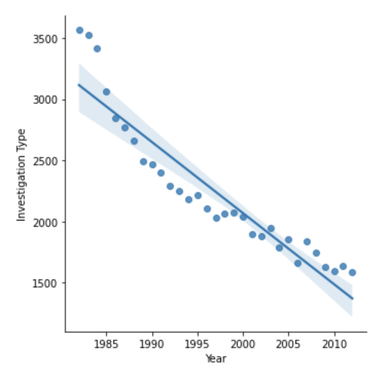
Figure 3.
 

Based on the slope of the line above we can see that it is clearly negative. Therefore we strongly believe that based on this data the number of accidents is decreasing as time goes on.  

Similarly, we can look at the total number of fatalities that are occuring overtime. This is seen below (Figure 4):
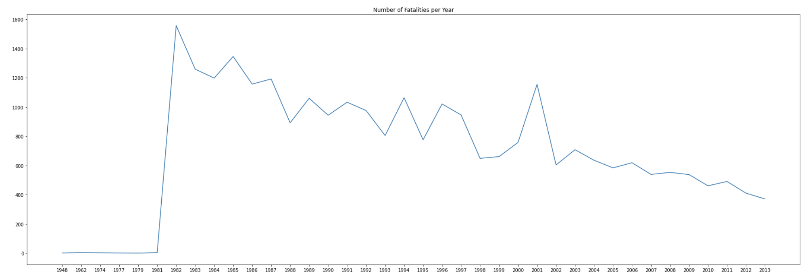
Figure 4.

Again we are seeing a decrease in the total number of fatalities that are occuring over the years. To further prove this we fit a line on this data. This is shown below:  (Figure 5)

Figure 5.

Once again we are seeing a decrease in the number of fatalities and a negative slope of this line. Therefore we can strongly conclude that the number of fatalities over time is decreasing. Overall, we can use these two analysis types to firmly argue that the flights are becoming safer overtime. 

We next set out to answer the question of predicting the total number of fatalities on a given flight. Using the method of Linear Regression, we are trying to predict the total number of fatalities that had occured. The parameters considered for the linear regression are Aircraft Damage, Make, Model, Amateur Built, Engine Type, Air Carrier, Weather Condition, Broad Phase of Flight, and Location State. The data is split into train and test data and the model is fit to predict the predictor. The test data is tested for prediction quality and found out that the model predicted most of the total fatality values correctly. The Root Mean Square Error (RMSE) is calculated to check the accuracy of the model and the RMSE observed is 3.4 and Mean Absolute Error (MAE) is found to be 0.428 with very few outliers. This is because most of the fatalities lie within a very small range from 0-10 fatalities and distributed mostly around 0-4 fatalities (Figure 6).
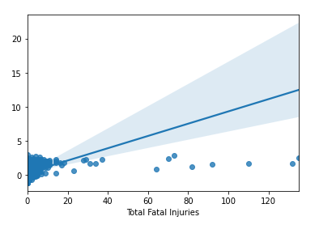
Figure 6.

Extending our analysis a bit further, the data has many good data points to analyze. One such that seemed interesting is the top 10 plane crashes by aircraft over the years. Our analysis provided 8 among top 10 makers that manufacture small and lightweight non-commercial planes had the most fatality rates with CESSNA and PIPER being the top two. Boeing is the only commercial maker which topped the list (Figure 7). This indicates that light-weighted non-commercial flights had a higher fatality rate compared to commercial ones! Our primary investigation without going too deep into the technicalities found that the non-commercial flight pilots were not trained properly over the years and have been operating with a single pilot mechanism over the flight. The above factors could obviously have had a direct or indirect impact on the fatalities rate observed in non-commercial flights.
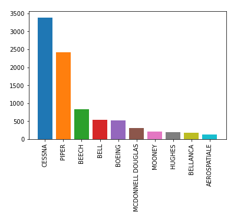
Figure 7. \
\
After analyzing the above data, one insight found is whether these manufacturers improved their quality and safety mechanisms to reduce the fatality rate over the years? This was in fact to be the case. Two among top 10 makers, CESSNA and PIPER, appear to have worked on their design and safety over the years which significantly reduced the fatality rates of those manufacturers over time (Figure 8). Also, we found that some blogs and data sources mention that the FAA had imposed strict regulations on non-commercial planes to improve their design to align with safety of commercial flights.
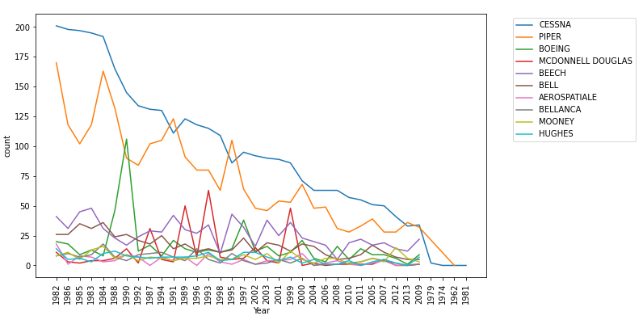
Figure 8.

To answer our third question (predicting whether a crash will be fatal or not) we used multiple approaches since it is a Binary Classification problem. First we used Logistic Regression, then Random Forests, and lastly Clustering after Dimensionality Reduction from Principal Component Analysis.

To perform Logistic Regression, `is_fatal` was used as an indicator variable to represent if the accident contained fatal injuries. Crash data was assessed solely from the United States as preliminary analysis showed little to no crash data contained from other countries. The `is_fatal` label variable was coded as follows 1=fatal, 0= not fatal. For this analysis, the predictor variables used were ‘Aircraft damage’, ‘Number of Engines’, and ‘Weather Condition’. These variables were chosen as they showed reasonable variance within the model and contained fewer missing values than other variables. The missing values that were contained within these features were encoded with the most frequent values for each category. With standard hyperparameters, the model had a prediction accuracy of 87% and an AUC value of 83%. After hyperparameter tuning with gridsearch, the score marginally improved to 88% and 84% respectively.

<!--  -->
<!--  -->
<!--  -->

The ROC curve below (Figure 9) shows the optimized parameter model does a reasonable job at distinguishing between when a plane crash is fatal and nonfatal. This is confirmed with the AUC value of 0.84.

Figure 9.

The normalized confusion matrix reflects this as well with most of the predictions being either true positives or true negatives (Figure 10).

Figure 10.

The probability distribution below (Figure 11) represents the likelihood of a fatal plane crash based on the predictor variables used as modeled by Logistic Regression. The Probability distribution of predictions by logistic regression shows primarily predicting no fatalities in plane crashes, with a jump in probability at around 0.6 showing a significant number of datapoints (around 2000) have around a 0.6 probability of being a fatal crash. This is based on the feature predictors used. What is very surprising is that there are some rows that have as high as a 0.8 probability of being a fatal crash. This suggests that there are certain crash predictors based on weather, aircraft damage and number of engines that will nearly guarantee a fatal crash. Most likely, a nearly completely totaled plane (especially one with significant engine damage) will have a 0.8 probability of being a fatal crash. 

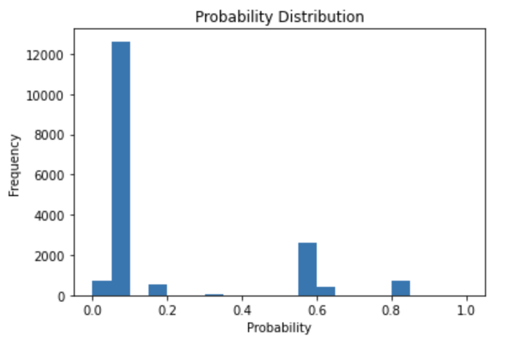
Figure 11.

Continuing off this analysis we took another approach to answer the question by using Random Forests. To binary classify whether a certain class would be fatal or not, we used a Random Forest (RF) Model. The RF model consisted of features/variables such as: Number of Engines, Month of the Crash, Type of Aircraft, Air Carrier, etc. The RF was run with a Grid Search that allowed for hyperparameter tuning. The Grid Search optimizes the hyperparameters and will return the model which results in the most accurate predictions. In this case, the Grid Search found that: the best criterion to measure the quality of the split was the Gini index, max depth of the tree to be 20, Max leaf nodes was set to None, and min sample leafs was set to be 5 (these can be seen from in the Jupyter Notebook). With these parameters selected, the RF returned a testing accuracy of 89.23% and a training accuracy of 92.76%. To compare these results we also ran a RF with default parameters and got a testing accuracy of 88.95% and training accuracy of 99.99%. This shows that the RF with Grid Search is a better model because it doesn’t overfit to the training data like the default RF, and the Grid Search RF also has a higher testing accuracy! The choice to use a Random Forest model is a stronger decision than using a Decision Tree because the Random Forest model is composed of a collection of Decision Trees and is able to make decisions based on multiple decision trees rather than just 1 DT. Along with that reasoning, hyperparameter tuning was able to make the model even better. Below is a table of our results from the Random Forest with Hyper Parameter tuning (Figure 12):

<!-- |    Stats   | Random Forest w/ Grid Search Results |
| --------------------- | -------------------------- |
| Accuracy      | 89.2312% |
| Precision   | 92.164% |
| Recall   | 94.822% |
| Specificity   | 64.8484% |
| False Negative Rate   | 5.177% |
| False Positive Rate   | 35.15% | -->

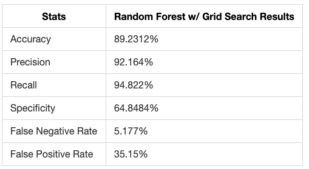
Figure 12.

Lastly, we tried using Principal Component Analysis (PCA) to reduce the dimensions, this is called dimensionality reduction.  PCA basically aims to reduce the number of variables of a data set, while preserving as much information as possible. Our dataset had 31 distinct features (columns) to begin with, which got reduced to 22 columns after preprocessing, out of which around 75% had discrete values in them. To prepare the data for PCA, we used standard scalar for continuous data and one hot encoding for categorical variables. To understand the relationship between data, we plotted a covariance matrix. As expected, the data was highly unrelated. It could be inferred that the inertia given to a categorical variable inherently depends on the number of modalities available to the variable, and on the probabilities of those modalities. As a result, it would be impossible to give a similar weight to all the initial variables over the calculated components. We tried alternate approaches like Multiple Correspondence Analysis - a variation of PCA to analyze categorical data and Factorial Analysis of Mixed Data, which generalized the PCA algorithm to incorporate both numerical and categorical data.

To prepare data to feed into models, it’s a good idea to find the correlation between different attributes. It is a statistical term that measures the degree of linear dependency between variables. Variables which are highly correlated do not add value to our predictive models and hence we tend to exclude them. In the figure below (Figure 13), I show the correlation plot for continuous variables. We can see that most of the variables are independent of each other with very little correlation between them.

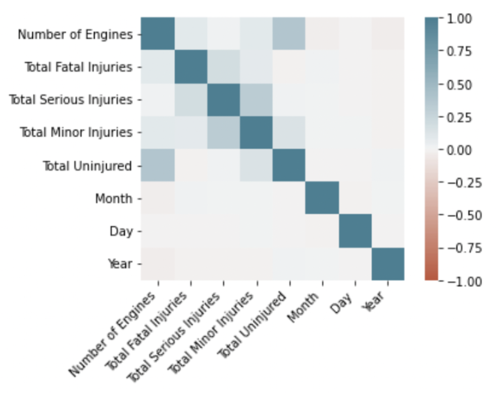
Figure 13.

After standard scaling of continuous values I applied PCA on the same subset to retrieve all the components. The positive and negative values in the next figure (Figure 14) represents the positive and negative correlation of the variables with the Principal Components of different attributes.

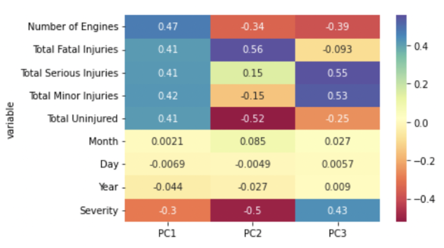
Figure 14.

Next we used a scatter matrix to determine how much each principal component contributes to the variance in data. From the diagram below (Figure 15) we can see that PC2 very clearly separates fatal and non-fatal injuries whereas PC3 and PC5 have major overlap and doesn’t help to make a clear distinction between target classes.

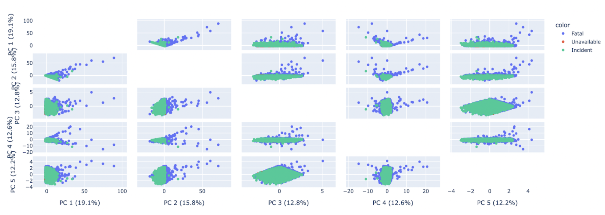
Figure 15.

# Comparisons

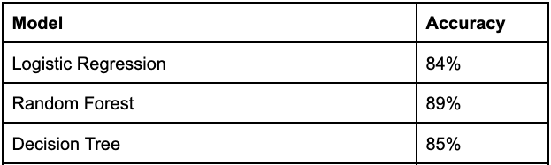
Figure 16.

When comparing the different binary classification methods such as Logistic regression, Random Forest and Decision Tree, it is completely reasonable that Random Forest outperformed both Decision Tree and Logistic Regression (Figure 16). The performance of Random Forest is largely due to its emphasis on feature selection, ability to ignore linear relationships within predictors and utilization of ensemble learning. Simply put, the random forest model will outperform decision trees in predicting whether a crash is fatal or not as it will utilize numerous decision trees before taking the overall average response. Lastly we tried k-means clustering to classify data. That approach didn’t work for our data for multiple reasons. K-means is an unsupervised clustering algorithm which is used to classify unlabelled data.Furthermore,  Kmeans works only with continuous data. In our case 70% of the data was categorical, moreover the target class(fatal/non fatal) was sparsely distributed and hence the clusters were not well defined.

# Conclusion
The airplane crash analysis ultimately focuses on the overall safety of flights. This analysis included exploratory data analysis to exhibit the trend that fewer and fewer airplane crashes are occurring each year. Based on specific features selected, it clearly can be proven that certain flight and crash characteristics will lead to plane crashes being fatal or not. Machine learning methods such as Random forest, Decision tree classification and Logistic regression were used to prove this to be the case with reasonable accuracy. Based on our findings there is significance to predict before a plane even leaves the runway whether it happened to crash the likelihood of this crash being fatal.  Additionally, based on the linear regression performed there is also significance in obtaining a rough estimate of the number of fatalities for a given flight crash based solely on plane and flight related attributes. Since the crash data used was contained within a high dimensional space, dimensionality reduction was performed to enhance the predictive accuracy of fatalities while preserving information. While due to limited resources, we were able to experiment only with PCA which is used for continuous data, there’s scope to perform dimensionality reduction for categorical and mixed data using derivatives like MCA (Multiple Correspondence Analysis) and FAMD (Factor Analysis of Mixed Data).

# References
[1] “Aviation Accident Database & Synopses.” NTSB Aviation Accident Database & Synopses, https://www.ntsb.gov/Pages/AviationQuery.aspx. 

[2] “MDB Download Directory - NTSB.ADMS.DataTransfer.Web”

[3] “Aviation Data Dictionary”, https://www.ntsb.gov/_layouts/15/ntsb.aviation/Aviation-
DownloadDataDictionary.aspx