# Abstract

This paper assesses the overall safety of aviation. Specifically in relation to plane crashes over time. Food for thought in this analysis includes questions such as whether it is becoming safer to fly over time. When crashes do occur, based on specific airplane and flight conditions, how likely is the crash to involve fatalities? By the term fatalities we mean deaths that were involved in the crash. This analysis utilized machine learning methods such as Linear Regression, Logistic Regression, Decision Trees, Random Forests, and experimentation with PCA. The ultimate findings showed that not only is aviation becoming increasingly safer, but when crashes do occur, it is completely feasible to predict whether those crashes will be fatal and if so, the number of fatalities. For future insight, this information may be used to better select and construct airplanes and decide on optimal flight times.

# Introduction

In the movies you hear the pilot yelling “Mayday Mayday!” over the intercom. What do you do? Brace? Hug your loved ones? Turn off airplane mode and text your family? We hope you never have to experience anything remotely close to this but the recent 20 year memorial of 9/11 got us thinking about what causes a plane to crash. Though we cannot completely eradicate the mishaps of airplanes, we will study the causes of fatalities and use various data mining techniques to determine the risk associated with flying.

Our dataset comes from the National Transportation and Safety Board and consists of over 74 thousand accidents and incidents from 1948 to 2013 (https://data.ntsb.gov/avdata). One of the problems that we set out to determine was whether aviation is becoming safer as time moves forward. This is quantified by analyzing the number of fatal accidents with respect to relevant crash data as well as quantifying the total number of accidents that have occured overtime. A second issue that we are addressing with this data is determining if a crash involving fatalities can be predicted given various factors/features. In our analysis, we have considered specific parameters that are crucial for predicting (or can lead up to) a crash, such as number of engines, weather, etc. It must be noted that although the data analyzed contains a large number of plane crashes, commercial aviation is regarded as extremely safe. According to NOVA, the risk of an American being killed in a plane crash is 1 in 11 million [4]. Also, a large misconception of this dataset is that it is only composed of airplane crashes that have fatalities, when in fact that is not true. While it does contain crashes, only about 23% (13089 rows) of the data does have fatalities, while the remaining 77% (57668 rows) is non-fatal airplane crashes. 

The analysis was performed with techniques such as Linear Regression to predict the total number of fatalities, Logistic Regression to determine the strongest flight predictors to lead to a fatal crash, Random Forest to binary classify if a crash would be fatal or not, component analysis methods like PCA and MCA to determine the prime components playing role in fatal crashes, and lastly experimenting with Clustering to see if any patterns emerge based on the degree of fatality incurred with each crash. But given the nature of our dataset we were unsuccessful with our experimentation. More in-depth details of these processes are seen in the Methods section.

#### Data Description 
\
We are using Aviation Accident Database from NTSB’s official website. The Data consists of 32 columns and 74428 rows. The data broadly consists of 5 categories:
- Accident Information : Event Data, Location, Investigation Type, Injury Severity
- Aircraft Information: Category, Amateur Built, Make, Model, Number of Engines, Engine Type, Damage
- Operation: Operation, Purpose of Flight, Schedule, Air Carrier
- NTSB status: Accident Number, Report Status, Probable Cause Issue Date
- Event Details: Airport Name, Airport Code, Weather Condition, Broad Phase of Flight, Longitude, Latitude

The specifics of each column, a short description, and their meaning can be found using Aviation Data Dictionary [3] (reference number 3 in our `References` section).

# Experiment and Analysis (Methods)

The main focus of our project/paper boils down to these questions and ideas. Analyzing crashes over time, can we infer that airplanes are becoming safer?  Based on the plane and crash attributes, is it possible to predict the number of fatalities on a said flight? Expanding on that, can we binary classify whether a crash will be fatal or not? Lastly, we also tried to determine the strongest feature(s) that could lead up to a crash. 

To begin our analysis we first looked into the number of fatal injuries that happened per year across different countries. According to our data the most number of incidents happened in the United States, hence it made sense to consider crashes across the USA for further analysis (Figure 1).
 
Figure 1. \
\
To answer the first question, we first set out to analyze the trends with the number of *accidents* and the number of fatalities that are occurring over time. Determining if flights are becoming safer over time is something that can be seen by plotting the total number of accidents that occur over the years. This is seen below (Figure 2):
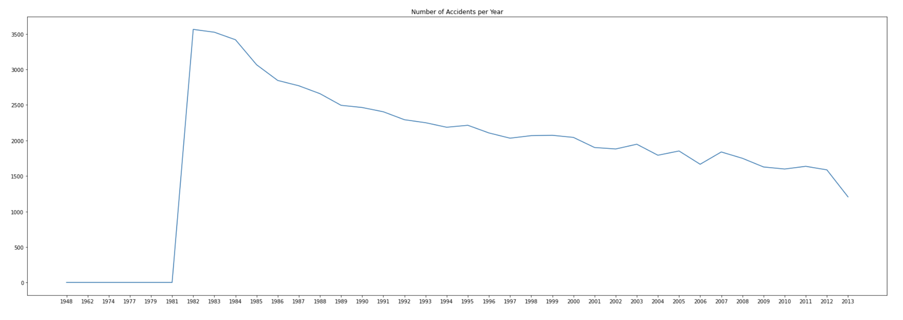
Figure 2. \
\
As we can see there appears to be a downwards trend to this data. To further prove that the data is on this trend we can fit a line (linear model) to the data and get the slope of that line. This is seen below (Figure 3):
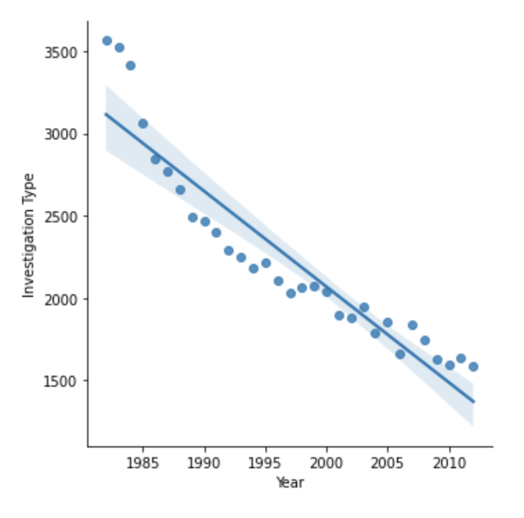
Figure 3.
 

Based on the slope of the line above we can see that it is clearly negative. Therefore we strongly believe that based on this data the number of accidents is decreasing as time goes on.  

Similarly, we can look at the total number of *fatalities* that are occuring overtime. This is seen below (Figure 4):
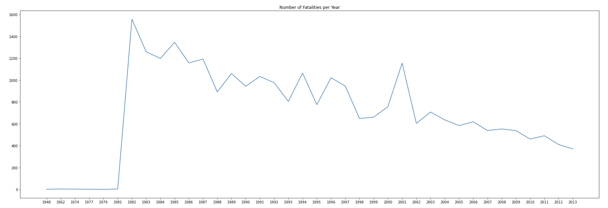
Figure 4.

Again we are seeing a decrease in the total number of fatalities that are occuring over the years. To further prove this we fit a line on this data. This is shown below:  (Figure 5)
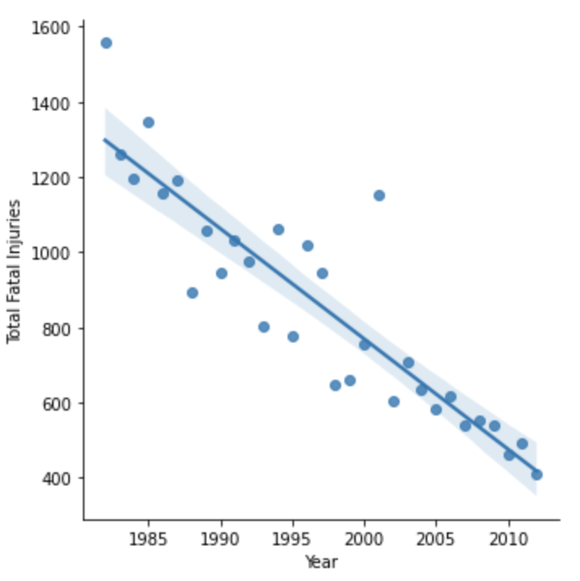
Figure 5.

Once again we are seeing a decrease in the number of fatalities and a negative slope of this line. Therefore we can strongly conclude that the number of fatalities over time is decreasing. Overall, we can use these two analysis types to firmly argue that the flights are becoming safer overtime. 

We next set out to answer the question of predicting the total number of fatalities on a given flight. Using the method of Linear Regression, we are trying to predict the total number of fatalities that had occured. The parameters considered for the linear regression are Aircraft Damage, Make, Model, Amateur Built, Engine Type, Air Carrier, Weather Condition, Broad Phase of Flight, and Location State. The data is split into train and test data and the model is fit to predict the predictor. The test data is tested for prediction quality and found out that the model predicted most of the total fatality values correctly. The Root Mean Square Error (RMSE) is calculated to check the accuracy of the model and the RMSE observed is 3.4 and Mean Absolute Error (MAE) is found to be 0.428 with very few outliers. This is because most of the fatalities lie within a very small range from 0-10 fatalities and distributed mostly around 0-4 fatalities (Figure 6). From our intuition, the data and results seem accurate because most of the fatalities fall under the band of 0-4 which is more probabilistic in the case of  small planes as they tend to carry fewer people relatively to commercial flights. 
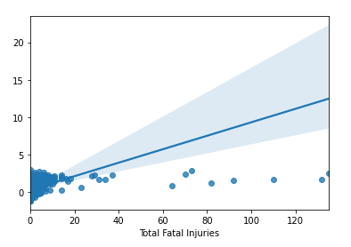
Figure 6.\
\
Extending our analysis a bit further, the data has many good data points to analyse. One such that seemed interesting is the top 10 plane crashes, analogically the number of fatalities  by aircraft manufacturers over the years. Our analysis provided that 8 among top 10 makers that manufacture small and lightweight non-commercial planes had the most fatality rates with CESSNA and PIPER being the top two. Boeing is the only commercial maker which topped the list (Figure 7). This indicates that light-weighted non-commercial flights had a higher fatality rate compared to commercial ones. Our primary investigation without going too deep into the technicalities found that the non-commercial flight pilots were not trained properly over the years and have been operating with a single pilot mechanism over the flight. The above factors could obviously have had a direct or indirect impact on the fatalities rate observed in non-commercial flights.
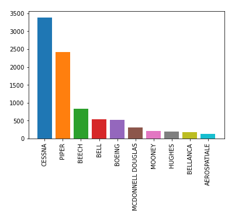
Figure 7. \
\
After analysing the above data, one insight found is whether these manufacturers improved their quality and safety mechanisms to reduce the fatality rate over the years? This was in fact to be the case. Two among top 10 makers CESSNA and PIPER appear to have worked on their design and safety over the years which significantly reduced the fatality rates of those manufacturers over time (Figure 8). Also, few data sources add concreteness to our analysis as they  mentioned  that the FAA had imposed strict regulations on non-commercial planes to improve their design to align with safety of commercial flights [5].

Figure 8.

To answer our third question (predicting whether a crash will be fatal or not) we used multiple approaches since it is a classification problem. First we used Logistic Regression, then Decision Trees, and then Random Forests. \
\
When performing Logistic Regression to predict whether a given crash will be fatal or not, `is_fatal` was used as an indicator variable to represent if the accident contained fatal injuries. Crash data was assessed solely from the United States as preliminary analysis showed little to no crash data contained from other countries. The label variable was encoded as follows: 1=fatal, 0=not fatal. Given no prior information from the data, any given crash selected at random has a 22.7% chance of being fatal. That would imply that for each row in the data, labeling each crash as not_fatal would result in a baseline accuracy of 77%. The goal of Logistic Regression is to improve on this baseline. For this analysis, the predictor variables used were ‘Aircraft damage’, ‘Number of Engines’, and ‘Weather Condition’. These variables were chosen as they showed reasonable variance within the model and contained fewer missing values than other variables. The missing values that were contained within these features were encoded with the most frequent values for each category. With standard hyperparameters, the model had a prediction accuracy of 87% and an AUC value of 83%. After hyperparameter tuning with gridsearch, the score marginally improved to 88% and 84% respectively. Although hypothesis testing was not performed comparing the model accuracy score against the baseline, based on the accuracy results, it may be assumed that the Logistic Regression model performs significantly better than guessing at random. \
\
The ROC curve below (Figure 9) shows the optimized parameter model does a reasonable job at distinguishing between when a plane crash is fatal and nonfatal. This is confirmed with the AUC value of 0.84.

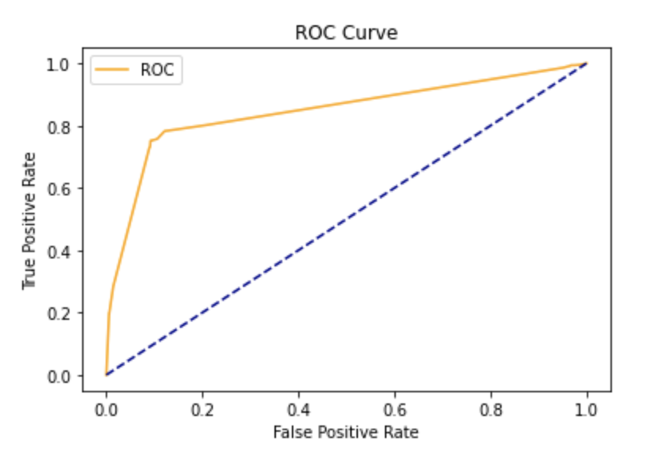
Figure 9.

The normalized confusion matrix reflects this as well with most of the predictions being either true positives or true negatives (Figure 10).

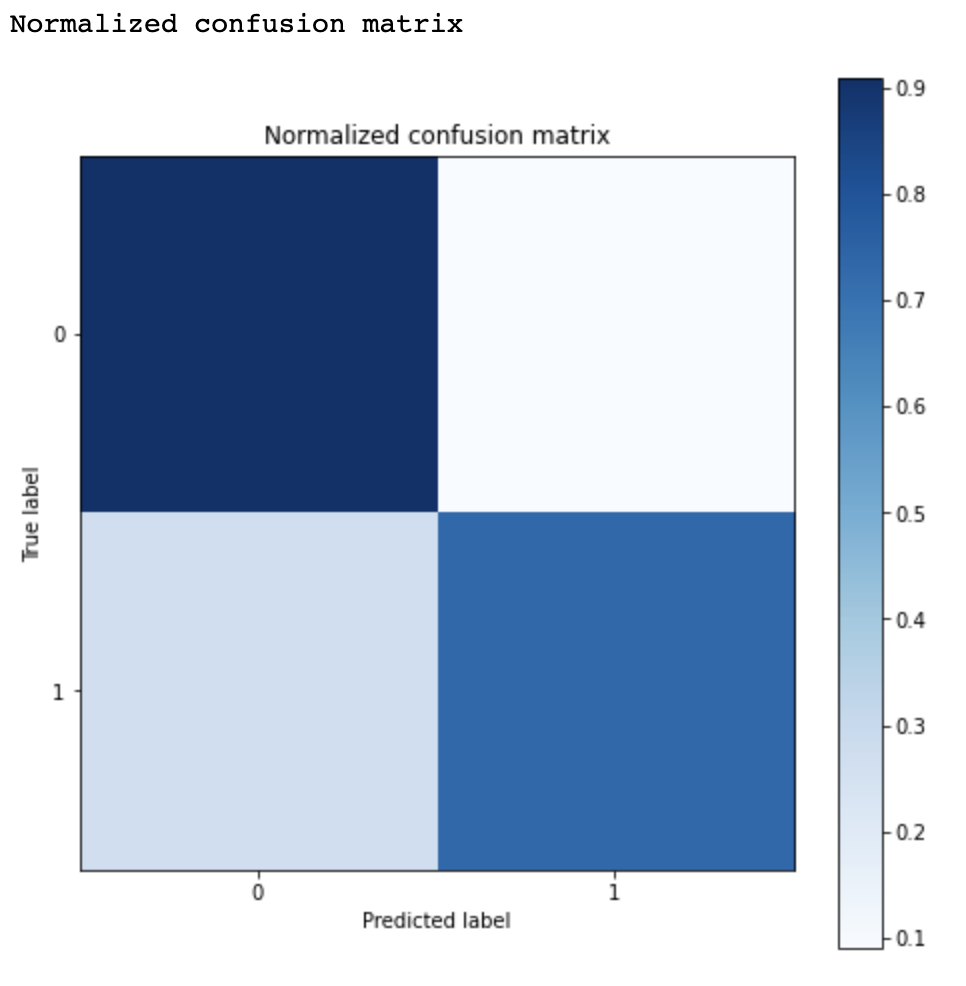
Figure 10.

The probability distribution below (Figure 11) represents the likelihood of a fatal plane crash based on the predictor variables used as modeled by logistic regression. The probability distribution of predictions by logistic regression shows primarily predicting no fatalities in plane crashes, with a jump in likelihood at around 0.6 showing a significant number of datapoints (around 2000) have around a 0.6 probability of being a fatal crash. This is based on the feature predictors used. What is surprising is that there are some rows that have as high as a 0.8 probability of being a fatal crash. This suggests that there are certain crash predictors based on weather, aircraft damage and number of engines that will nearly guarantee a fatal crash. Most likely, a nearly completely totaled plane (especially one with significant engine damage) will have a 0.8 probability of being a fatal crash.  

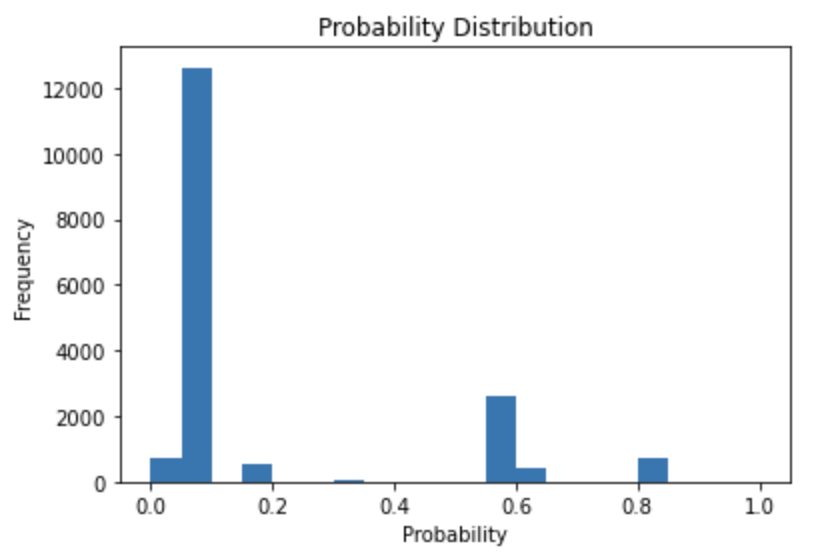
Figure 11.

Continuing off this analysis we took another approach to predicting whether a crash will be fatal or not by using Random Forests (RF). The RF model consisted of features/variables such as: Number of Engines, Month of the Crash, Type of Aircraft, Air Carrier, etc. The RF was performed with a Grid Search that allowed for hyperparameter tuning. The Grid Search optimizes the hyperparameters and will return the model which results in the most accurate predictions. In this case, the Grid Search found that: the best criterion to measure the quality of the split was the Gini index, max depth of the tree to be 20, Max leaf nodes was set to None, and min sample leafs was set to be 5 (these can be seen from in the Jupyter Notebook). With these parameters selected, the RF returned a testing accuracy of 89.23% and a training accuracy of 92.76%. To compare these results we also ran a RF with default parameters and got a testing accuracy of 88.95% and training accuracy of 99.99%. This shows that the RF with Grid Search is a better model because it doesn’t overfit to the training data like the default RF, and the Grid Search RF also has a higher testing accuracy! The choice to use a Random Forest model is a stronger decision than using a Decision Tree because the Random Forest model is composed of a collection of Decision Trees and is able to make decisions based on multiple decision trees rather than just one DT. Along with that reasoning, hyperparameter tuning was able to make the model even better. Below is a table of our results from the Random Forest with Hyper Parameter tuning (Figure 12):

Figure 12.

#### PCA & MCA 
\
\
Lastly, we experimented with Principal Component Analysis to *represent data in a smaller dimension* and also *uncover relationships between variables*. PCA basically aims to reduce the number of variables of a data set, while preserving as much information as possible. Our dataset had 31 distinct features (columns) to begin with, which got reduced down to 22 columns after preprocessing, out of which around 75% had categorical data in them. Example features include Weather Condition, Make, Model, Injury Severity to name a few.

To prepare the data for PCA, we used a standard scalar for continuous data. Further to check for linear dependency between numerical data we plotted the covariance matrix (Figure 13). We could infer from the figure below that there was little correlation between the different features.

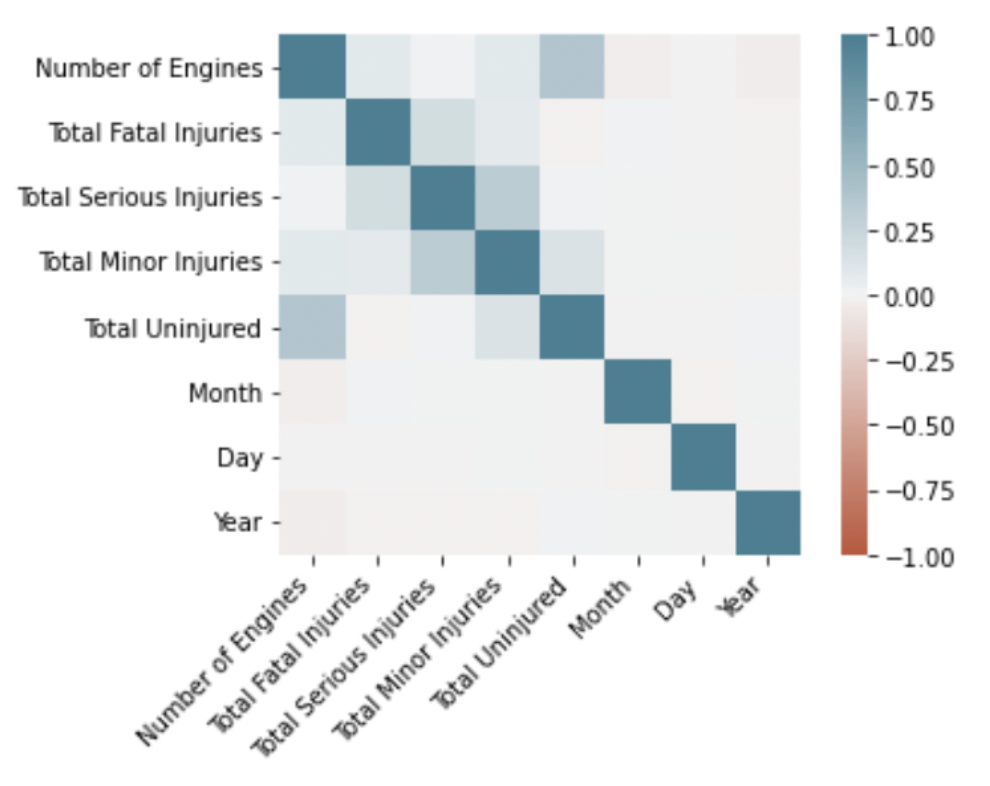
Figure 13.

After standard scaling of continuous values, PCA was applied on the same subset of features to retrieve three principal components (Figure 14). The positive and negative values on the figure below represent the positive and negative correlation of the variables with the principal components of different attributes. The key factor to notice here is that PC3 is positively related to severity. 

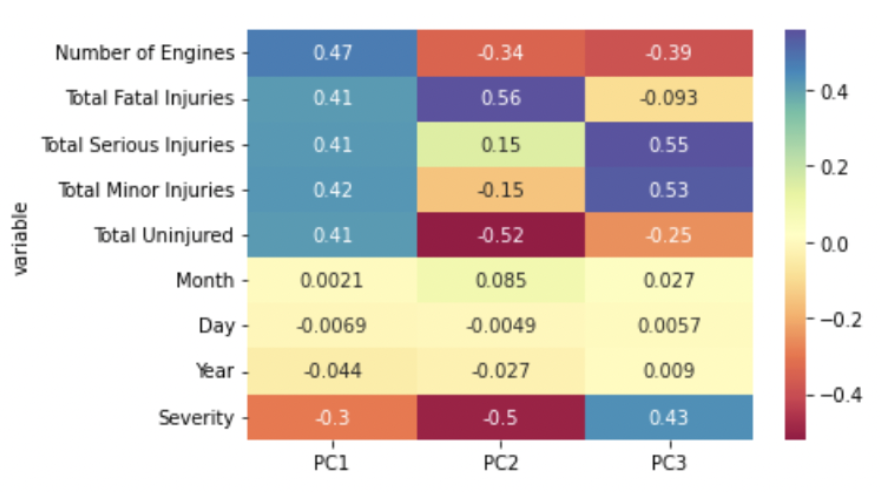
Figure 14.

Next we used a scatter matrix to determine how much each principal component contributes to the variance in the data. Since our components were based on only 5 out of 22 features, the components didn’t help in making a clear distinction between the 3 classes of injury severity (Fatal, Non-fatal and Incident) (Figure 15). 

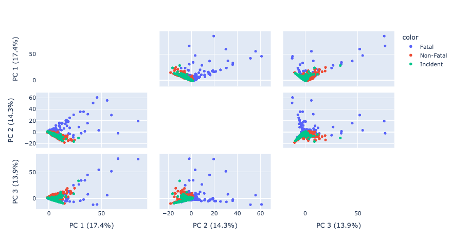
Figure 15.

To address the problem above, we tried an alternate approach called Multiple Correspondence Analysis - a variation of PCA to analyze categorical data. We considered specific features namely - 'Aircraft Damage','Weather Condition', 'Injury Severity', 'Engine Type' to perform our analysis. (Figure 16)

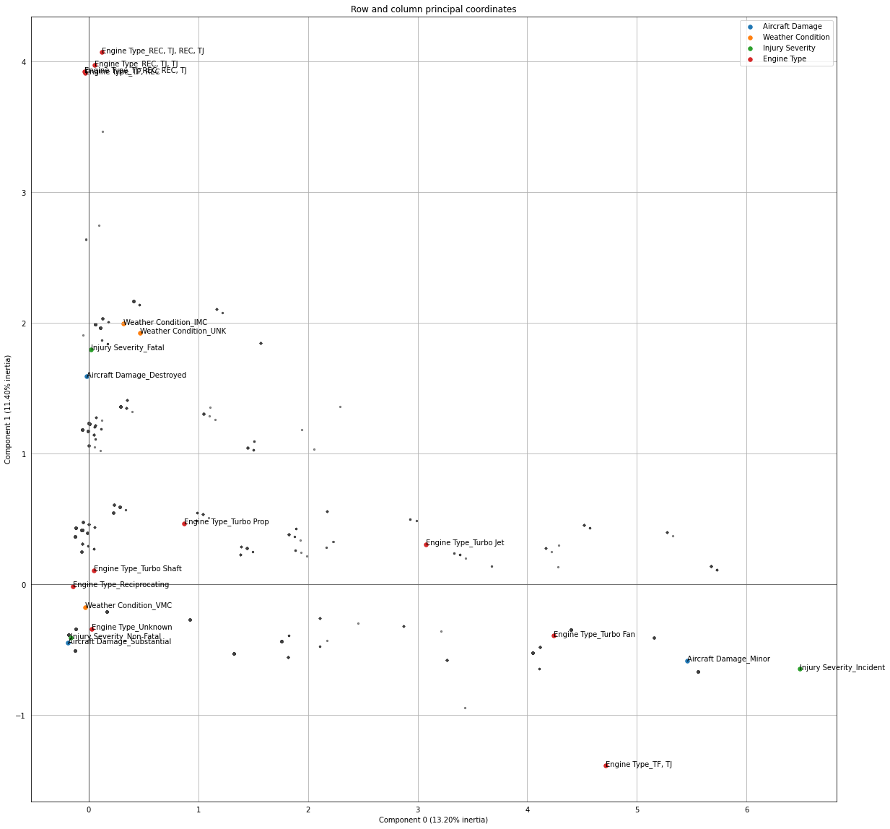
Figure 16.

Upon plotting the centers of principal components as shown in the graph below, we found that the center for weather conditions [IMC & VMC] lie close to Fatal Injury Severity. This essentially means that such weather conditions may lead to a fatal crash. We further validated this observation by plotting the number of fatal injuries against different weather conditions as shown in the graph below (Figure 17).
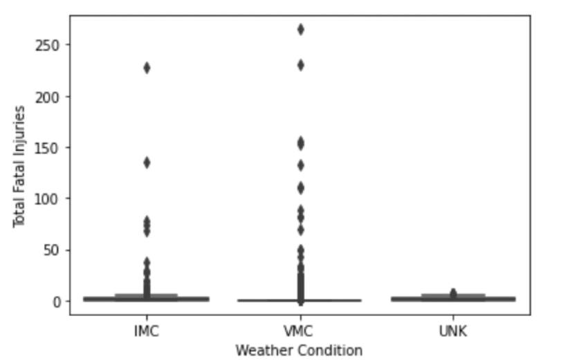
Figure 17.

# Comparisons

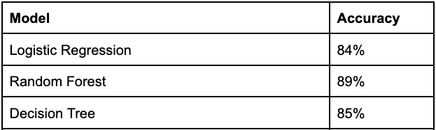
Figure 18.

When comparing the different binary classification methods such as Logistic regression, Random Forest and Decision Tree, it is completely reasonable that Random Forest outperformed both Decision Tree and Logistic Regression. The performance of Random Forest is largely due to its emphasis on feature selection, ability to ignore linear relationships within predictors and utilization of ensemble learning. Simply put, the random forest model will outperform decision trees in predicting whether a crash is fatal or not as it will utilize numerous decision trees before taking the overall average response. For Linear Regression, the Root Mean Square Error (RMSE) is calculated to check the accuracy of the model and the RMSE observed is 3.4 and Mean Absolute Error (MAE) is found to be 0.428 with very few outliers.

# Conclusion
Our airplane crash analysis ultimately focuses on the overall safety of flights. This analysis included Exploratory Data Analysis to exhibit the trend that fewer and fewer airplane crashes are occurring each year. Based on specific features selected, it can be argued that certain flight and crash characteristics will lead to plane crashes being fatal or not. Machine learning methods such as Random Forest, Decision Trees and Logistic regression were used to demonstrate this to be the case with reasonable accuracy. Additionally, based on the Linear Regression performed there is also significance in obtaining a rough estimate of the number of fatalities for a given flight crash based solely on plane and flight related attributes. Since the crash data used was contained within a high dimensional space, dimensionality reduction was performed to enhance the predictive accuracy of fatalities while preserving information. PCA was used to experiment with continuous data and MCA for categorical data. Although the results from PCA weren't of much use as we didn’t have enough continuous data, we did get some insights from MCA about prime categorical components that could potentially lead to a fatality. If we were to do this project again we would consider: combining this dataset with another large dataset in order to get more insights into the trends of the data and that bigger data would allow for more accurate models, we would implement more of a variety of models like XGBoost and such, we would also spend more time on the PCA and MCA portion and rerunning the output of that into our models and more. 

# References
[1] “Aviation Accident Database & Synopses.” NTSB Aviation Accident Database & Synopses, https://www.ntsb.gov/Pages/AviationQuery.aspx. 

[2] “MDB Download Directory - NTSB.ADMS.DataTransfer.Web”

[3] “Aviation Data Dictionary”, https://www.ntsb.gov/_layouts/15/ntsb.aviation/AviationDownloadDataDictionary.aspx

[4] “Nova | the Deadliest Plane Crash | How Risky Is Flying?” PBS, Public Broadcasting Service, https://www.pbs.org/wgbh/nova/planecrash/risky.html#:~:text=The%20annual%20risk%20of%20being,is%20about%201%20in%205%2C000. 

[5] “Standards and Regulations by FAA”  https://www.ncbi.nlm.nih.gov/books/NBK219015/